<!-- markdownlint-disable MD013 MD033 MD041 -->

 

<strong>SECURITY&nbsp;&nbsp;·&nbsp;&nbsp;REVERSE ENGINEERING&nbsp;&nbsp;·&nbsp;&nbsp;SYSTEMS</strong>

  

<code>0day/pwned</code>&nbsp;&nbsp; <code>shipping from a neutron star</code>

  

<em>Software engineer with a tendency to build things that probably shouldn't exist.</em>

  

  

<h2>CONTRIBUTION SIGNAL // LIVE</h2>

<picture>
  <source media="(prefers-color-scheme: dark)" srcset="https://raw.githubusercontent.com/Nick190401/Nick190401/output/github-contribution-grid-snake-dark.svg" />
  <source media="(prefers-color-scheme: light)" srcset="https://raw.githubusercontent.com/Nick190401/Nick190401/output/github-contribution-grid-snake.svg" />
  
</picture>

BREAK ASSUMPTIONS. TRACE EVERYTHING. HARDEN SYSTEMS. SHIP THE IMPOSSIBLE.

