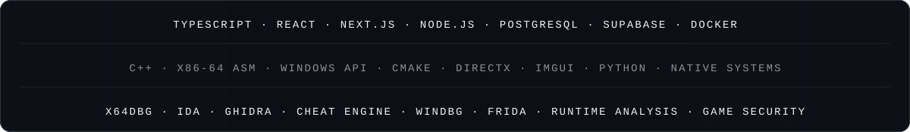

<!-- markdownlint-disable MD013 MD033 MD041 -->

<h3 align="left">I build across the stack. Then I go below it.</h3>

Interfaces, APIs, data, automation, native systems — whatever the product needs. 
If the abstraction leaks, I go lower. If behavior is unclear, I trace it. If trust matters, I verify the boundary.

 

 

 

