<div align="center">



<br />

<strong>PRODUCT ENGINEERING&nbsp;&nbsp;·&nbsp;&nbsp;AI SYSTEMS&nbsp;&nbsp;·&nbsp;&nbsp;AUTOMATION</strong>

<br /><br />

<code>local-first when possible</code>&nbsp;&nbsp; <code>production-shaped always</code>

</div>

<br />

```text
MISSION CONTROL / NICK
──────────────────────────────────────────────────────────────
STATUS          shipping
BASE            neutron star
CURRENT SIGNAL  browser internals × applied AI × product engineering
DEFAULT MODE    build → break → verify → ship
──────────────────────────────────────────────────────────────
```

> Software engineer with a tendency to build things that probably shouldn't exist.

## `01 // OPERATING SYSTEM`

```text
ARCHITECTURE    simple
EXECUTION       fast
STANDARDS       high
DETAILS         obsessive
PRODUCTION      preferred
UNNECESSARY     disabled
```

```text
FULL-STACK ENGINEERING  ── interfaces backed by real systems
AI SYSTEMS              ── grounded, observable, useful
AUTOMATION              ── repetitive work does not survive
SECURITY                ── trust boundaries before happy paths
```

## `02 // TOOLCHAIN`

```text
PRODUCT     React · Next.js · Vite · Phaser
SYSTEMS     Node.js · Python · C++ · Chrome MV3
DATA        Supabase · PostgreSQL · Row Level Security
DELIVERY    Docker · GitHub Actions · test-first release gates
```

<div align="center">


</div>

## `03 // CONTRIBUTION SIGNAL`

<picture>
  <source media="(prefers-color-scheme: dark)" srcset="https://raw.githubusercontent.com/Nick190401/Nick190401/output/github-contribution-grid-snake-dark.svg" />
  <source media="(prefers-color-scheme: light)" srcset="https://raw.githubusercontent.com/Nick190401/Nick190401/output/github-contribution-grid-snake.svg" />
  
</picture>

<div align="center">


<br />

```text
IDEA ─────► BUILD ─────► BREAK ─────► VERIFY ─────► SHIP
  ▲                                                   │
  └─────────────────── LEARN / REPEAT ────────────────┘
```

<sub>Good systems survive contact with reality.</sub>

</div>
